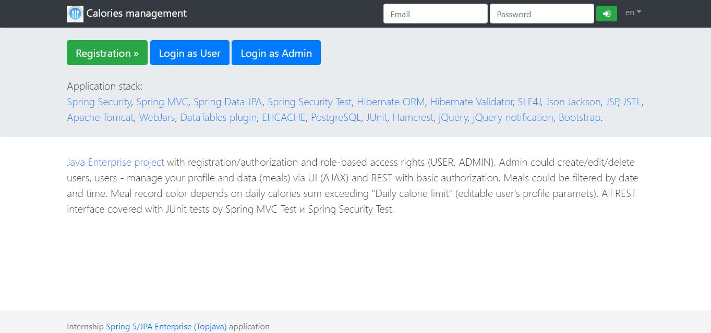
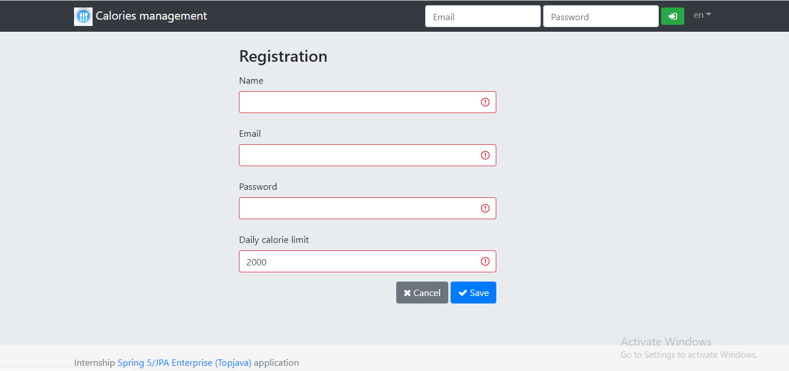
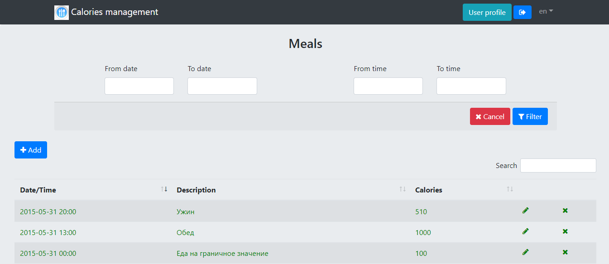
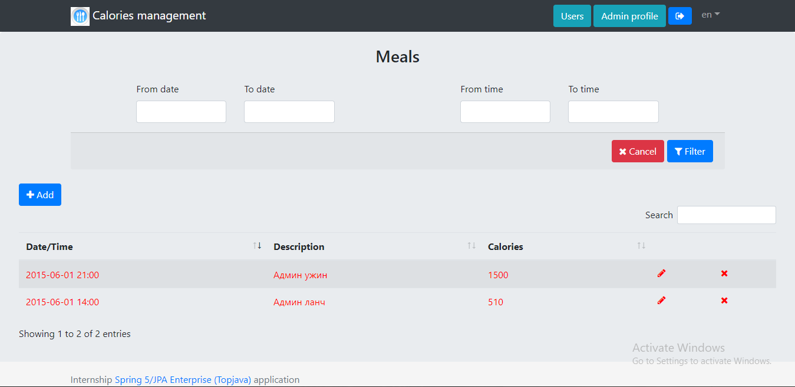
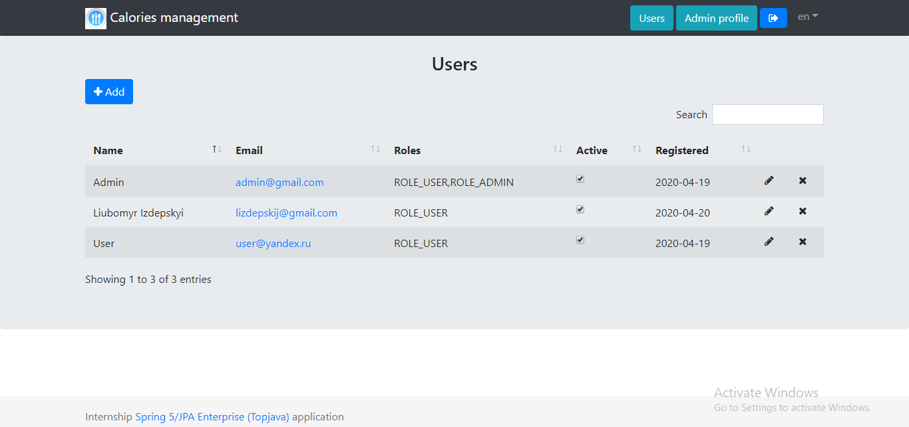
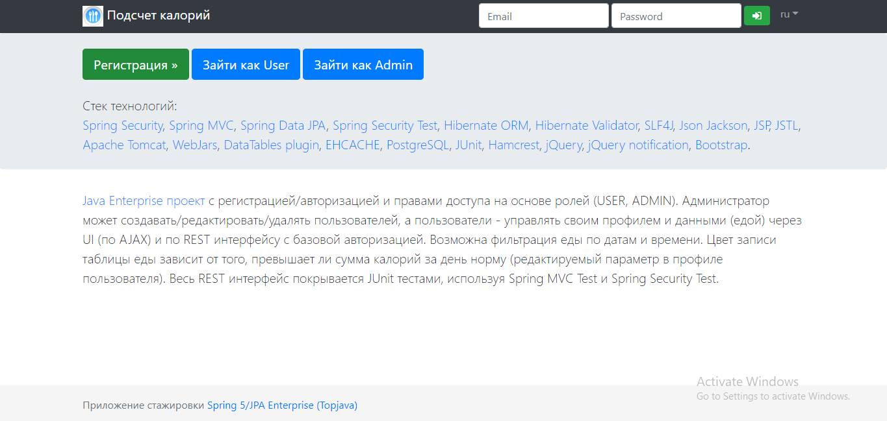
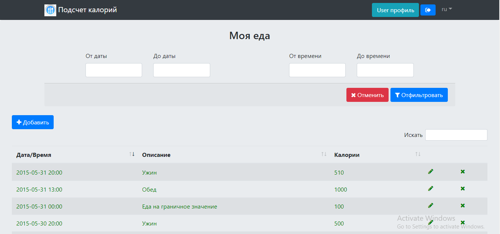

Visit the Website of this Project:
http://liubomyrtopjavaee.herokuapp.com/

Development of a fully functional Spring / JPA Enterprise application with authorization and role-based access rights using the most popular Java tools and technologies: Maven, Spring MVC, Security, JPA (Hibernate), REST (Jackson), Bootstrap (css, js), datatables, jQuery + plugins, Java 8 Stream and Time API and storage in Postgresql and HSQLDB databases.

    When you hear something, you forget it.
    When you see something, you remember it.
    But only when you start doing this,
    you begin to understand it.
    
    Ancient Chinese saying

